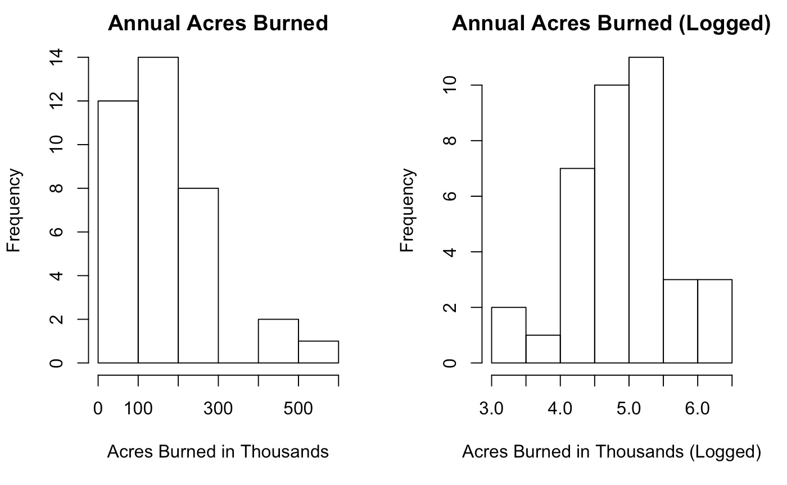
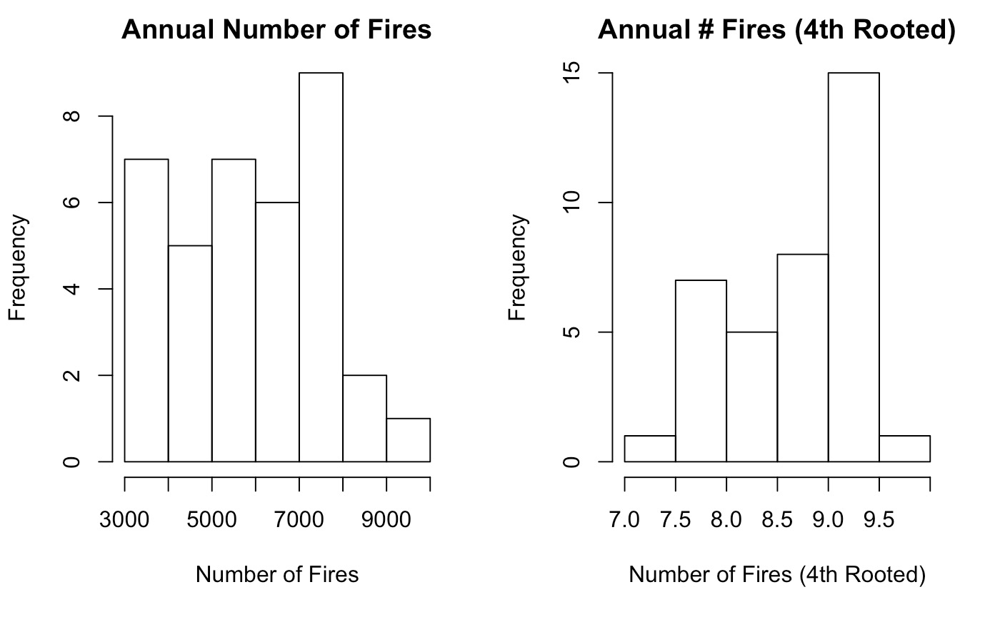
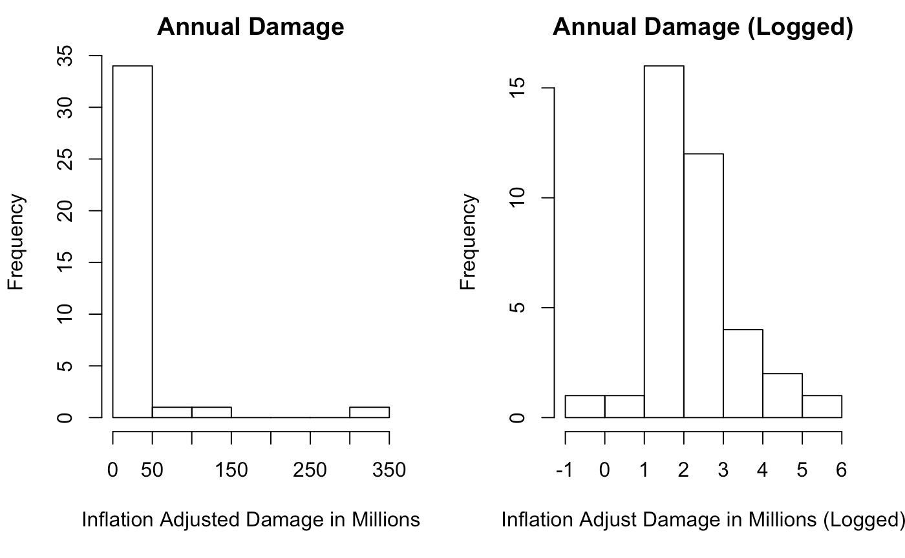

```{r setup, include=FALSE}
knitr::opts_chunk$set(echo = TRUE)
```

## Abstract

It is undeniable that the climate of the world is changing. Multiple studies^[IPCC Fifth Assessment Report: Summary for Policymakers, https://www.ipcc.ch/site/assets/uploads/2018/02/AR5_SYR_FINAL_SPM.pdf] have pointed out that "warming of the climate system is unequivocal, and since the 1950s, many of the observed changes are unprecedented over decades to millennia. The atmosphere and ocean have warmed, the amounts of snow and ice have diminished, and sea level has risen." This issue becomes controversial, and often politicized, when we examine the cause of these rapid and dangerous changes in our climate.

Humans impact the Earth in a number of ways, some of which are deleterious. While human innovation has leaped forward since the industrial revolution, so have our reliance on fossil fuels for energy, greenhouse gas emissions, water pollution, and deforestation. All of these are intimately connected to the systems that control the planet, including climate, so it is logical for us to expect that human action is linked to climate change, and may even be the main cause of it.

This analysis looks at the relationship between anthropogenic emissions (like CO$_2$, methane, and other greenhouse gases), anthropogenic alterations to the landscape (like deforestation, and coral reef destruction), human energy usage trends (like fossil fuel reliance), and the rate and intensity of natural disasters. While other manifestations of climate change, like the disappearance of coastal lands and property, or the destruction of certain Arctic marine habitats, are important, we chose to focus on natural disasters because in our opinion, they most clearly present simultaneously the most dangerous, time-sensitive, and contemporaneously relevant aspects of this phenomenon.

## Motivation

Both team members are from areas of the world that are currently at high risk of damage due to increasingly frequent and powerful natural disasters. Hakeem Angulu is from Jamaica, an island lying in the path of many hurricanes that originate in the Atlantic (Sandy, Wilma, Gilbert, etc.), and sometimes in the Gulf Coast (Katrina, Ivan, Nate, etc.). Louie Ayre is from California, a state wracked by increasingly intense forest fires (with 3 major blazes in November 2018 alone). For both, climate change is not only "real", but here right now, and affecting major aspects of their lives. Both understand that it is our duty, as humans, to attempt to mitigate the effects of this phenomenon, and that process starts with understanding and recognizing the phenomenon's origin. This analysis seeks to do that, and tie that conceptual understanding to concrete social and economic measures to further bolster their belief that swift action is necessary.

\newpage

## Hypothesis

Our hypothesis is as follows:

\textit{There is an association between anthropogenic emissions and human resource usage trends and the rate and intensity of natural disasters.}

Each of the elements of the above hypothesis is well proxied by predictor and response variables of interest:

\underline{Predictors:}

\begin{itemize}
  \item Anthropogenic emissions:
  \begin{itemize}
    \item CO$_2$ atmospheric levels
    \item CO$_2$ emissions
    \item Methane atmospheric levels
    \item Methane emissions
    \item Industrial emissions
  \end{itemize}
  \item Human resource usage trends:
  \begin{itemize}
    \item Energy consumption
    \item Energy production
  \end{itemize}
\end{itemize}

\underline{Response:}

\begin{itemize}
  \item The rate and intensity of natural disasters:
  \begin{itemize}
    \item The number, type, and intensity of storms affecting regions in the United States
    \item The amount of land affected by fires in California per year
    \item The numbers of people displaced, injured, and killed due to natural disasters
    \item The amount of flooding in the United States per year
    \item The amount of money spent on repairing post-natural disaster property damage
  \end{itemize}
\end{itemize}

With these variables, we also built models to investigate their relationship, which we hope is useful for understanding, concretizing, and contextualizing the problem at hand.

## Data

The data were collected from a multitude of sources, listed below:

\begin{itemize}
  \item National Centers for Environmental Information: National Oceanic and Atmospheric Administration's Storm Events Database\footnote{NOAA, "National Oceanic and Atmospheric Administration's Storm Events Database" https://www.ncdc.noaa.gov/stormevents/ftp.jsp}.
  
  This database includes information about storms (heavy rain, heavy snowfall, hurricane (typhoon), tropical storm, etc.) in every state in the United States from 1950 to 2018. It includes direct and indirect fatalities, estimated property damage, and estimated crop damage for each storm.
  \item US Energy Information Association: State Carbon Dioxide Emissions Data\footnote{EIA, "State Carbon Dioxide Emissions Data" https://www.eia.gov/environment/emissions/state/}.
  
  This database includes information about emissions, by state for every state from 1980 to 2018. It breaks data down by the emission type (from coal or from petroleum) and by the emitter (commerical or industrial).
  \item CAL Fire: Incident Information Page\footnote{CAL Fire, "CAL FIRE Jurisdiction Fires, Acres, Dollar Damage, and Structures Destroyed." \newline http://cdfdata.fire.ca.gov/pub/cdf/images/incidentstatsevents\_270.pdf}.
  
  This database includes information about all fires in CAL Fire's jurisdiction in California from 1933 to 2016. CAL Fire is the California Department of Forestry and Fire Protection, and is the State of California's agency responsible for fire protection in State Responsibility Areas of California, totaling 31 million acres, as well as the administration of the state's private and public forests. Data include the dollar damage of fires, the amount of land burned in acres, and the number of fires per year.
  \item US Energy Information Association: State Energy Data System (SEDS)\footnote{EIA, "State Energy Data System (SEDS): 1960-2016 (complete)" \newline https://www.eia.gov/state/seds/seds-data-complete.php?sid=US\#Consumption}
  
  This database includes information about every state's energy consumption and production from 1960 to 2016. The data are separated by energy source (i.e. nuclear, coal, biomass, etc.).
  \item National Centers for Environmental Information: Earth System Research Laboratory, Global Montioring Divisioni\footnote{NOAA, "Trends in Atmospheric Methane" https://www.esrl.noaa.gov/gmd/ccgg/trends\_ch4/\#global\_data}.
  
  This database includes information on methane atmospheric concentration from 1980 to 2016.
  \item National Centers for Environmental Information: Earth System Research Laboratory, Global Montioring Divisioni\footnote{NOAA, "Trends in Atmospheric Carbon Dioxide" https://www.esrl.noaa.gov/gmd/ccgg/trends/global.html}.
  
  This database includes information on CO$_2$ atmospheric concentration from 1980 to 2016.
\end{itemize}

## Methods

The analysis of this data is separated into four regions: California, the Northeast, the Midwest, and the South. This was done to account for high variance in the type of natural disasters affecting the United States. For example, California tends to experience a lot of droughts and fires, so the analysis of those specific phenomena in that place was most useful, and most intuitive given the research problem. Different disasters affect places differently, and in an analysis focused on parsing out the relationship between human influence and rate and intensity of these disasters, a more nuanced regional approach is warranted. The region delineation is as follows:

\begin{itemize}
  \item California: California
  \item The Northeast: Connecticut, Maine, Massachussets, New Hampshire, Rhode Island, Vermont, New Jersey, New York, Pennsylvania, Delaware, Maryland, and District of Columbia
  \item The Midwest: Illinois, Indiana, Iowa, Kansas, Michigan, Minnesota, Missouri, Nebraska, North Dakota, Ohio, South Dakota, and Wisconsin
  \item The South: Florida, Georgia, North Carolina, South Carolina, Virginia, West Virginia, Alabama, Kentucky, Mississippi, Tennessee, Arkansas, Louisiana, Oklahoma, and Texas
\end{itemize}

Note: some states have not been included in a region, particularly the Pacific Northwest and Western states. These states do experience many of the natural disasters we analyze, but the data were difficult to maneuver for the regional analysis that we wanted to focus on.

After the data were cleaned and appropriately transformed, we used a variety of linear, higher-order (like quadratic), and multiple regressions.

Our model selection process relied heavily on our observations of the data, our intuition about expected signs, stepwise variable selection, and comparisons of AIC and R$^2$.

\newpage

The following tables summarize each region's variables. All dollar values have been adjusted for inflation. All numbers are given to three decimal places of precision, and atmospheric methane and CO$_2$ concentrations are reported once (since they are global measurements).

California:

\begin{center}
  \begin{table}[h]
  \caption{\label{tab:table-name}California Region Variable Summary}
  \smallskip
  \begin{center}
  \begin{tabular}{|l r r|}
  \hline
  Variable & Mean & SD \\ [0.5ex] 
  \hline\hline
  number of fires & $5,858.514$ & $1698.339$ \\ 
  \hline
  land burned (acres) & $16,5835$ & $112943.2$ \\
  \hline
  property damage valuation (dollars) & $198.383 \times 10^6$ & $526.231 \times 10^6$ \\
  \hline
  coal emissions (million tonnes of CO$_2$) & $5.873$ & $1.679$ \\
  \hline
  petroleum emissions (million tonnes of CO$_2$) & $231.365$ & $14.129$ \\
  \hline
  industrial emissions (million tonnes of CO$_2$) & $66.592$ & $4.153$ \\ 
  \hline
  total energy produced (billions of BTU) & $2.979 \times 10^6$ & $0.388 \times 10^6$ \\
  \hline
  renewable energy produced (billions of BTU) & $0.704 \times 10^6$ & $0.099 \times 10^6$ \\
  \hline
  non-renewable energy produced (billions of BTU) & $2.275 \times 10^6$ & $0.421 \times 10^6$ \\
  \hline
  atmospheric CO$_2$ concentration (PPM) & $367.350$ & $18.915$ \\
  \hline
  atmospheric methane concentration (PPB) & $1,740.096$ & $69.776$ \\ [1ex] 
  \hline
  \end{tabular}
  \end{center}
  \end{table}
\end{center}

The Northeast:

\begin{center}
  \begin{table}[h]
  \caption{\label{tab:table-name}Northeast Region Variable Summary}
  \smallskip
  \begin{center}
  \begin{tabular}{|l r r|}
  \hline
  Variable & Mean & SD \\ [0.5ex] 
  \hline\hline
  number of people injured & $91.892$ & $206.708$ \\ 
  \hline
  number of deaths & $7.973$ & $11.219$ \\
  \hline
  property damage valuation (dollars) & $36.805 \times 10^6$ & $72.984 \times 10^6$ \\
  \hline
  coal emissions (million tonnes of CO$_2$) & $196.987$ & $35.353$ \\
  \hline
  petroleum emissions (million tonnes of CO$_2$) & $390.624$ & $37.322$ \\
  \hline
  industrial emissions (million tonnes of CO$_2$) & $102.308$ & $24.327$ \\ 
  \hline
  total energy produced (billions of BTU) & $5.239 \times 10^6$ & $1.546 \times 10^6$ \\
  \hline
  renewable energy produced (billions of BTU) & $0.931 \times 10^6$ & $0.0783 \times 10^6$ \\
  \hline
  non-renewable energy produced (billions of BTU) & $4.308 \times 10^6$ & $1.521 \times 10^6$ \\
  \hline
  \end{tabular}
  \end{center}
  \end{table}
\end{center}

The Midwest:

\begin{center}
  \begin{table}[h!]
  \caption{\label{tab:table-name}Midwest Region Variable Summary}
  \smallskip
  \begin{center}
  \begin{tabular}{|l r r|}
  \hline
  Variable & Mean & SD \\ [0.5ex] 
  \hline\hline
  number of people injured & $300.351$ & $243.383$ \\ 
  \hline
  number of deaths & $18.757$ & $28.055$ \\
  \hline
  property damage valuation (dollars) & $452.597 \times 10^6$ & $348.955 \times 10^6$ \\
  \hline
  coal emissions (million tonnes of CO$_2$) & $659.370$ & $73.599$ \\
  \hline
  petroleum emissions (million tonnes of CO$_2$) & $458.616$ & $30.712$ \\
  \hline
  industrial emissions (million tonnes of CO$_2$) & $247.622$ & $20.593$ \\ 
  \hline
  total energy produced (billions of BTU) & $8.104 \times 10^6$ & $1.772 \times 10^6$ \\
  \hline
  renewable energy produced (billions of BTU) & $1.364 \times 10^6$ & $0.820 \times 10^6$ \\
  \hline
  non-renewable energy produced (billions of BTU) & $6.739 \times 10^6$ & $1.074 \times 10^6$ \\
  \hline
  \end{tabular}
  \end{center}
  \end{table}
\end{center}

\newpage

The South:

\begin{center}
  \begin{table}[h!]
  \caption{\label{tab:table-name}South Region Variable Summary}
  \smallskip
  \begin{center}
  \begin{tabular}{|l r r|}
  \hline
  Variable & Mean & SD \\ [0.5ex] 
  \hline\hline
  number of people injured & $548.238$ & $1,462.097$ \\ 
  \hline
  number of deaths & $128.619$ & $212.942$ \\
  \hline
  property damage valuation (dollars) & $2,012.636 \times 10^6$ & $2,789.095 \times 10^6$ \\
  \hline
  coal emissions (million tonnes of CO$_2$) & $805.291$ & $106.227$ \\
  \hline
  petroleum emissions (million tonnes of CO$_2$) & $951.419$ & $51.400$ \\
  \hline
  industrial emissions (million tonnes of CO$_2$) & $472.400$ & $47.251$ \\ 
  \hline
  total energy produced (billions of BTU) & $32.429 \times 10^6$ & $2.615 \times 10^6$ \\
  \hline
  renewable energy produced (billions of BTU) & $1.920 \times 10^6$ & $0.343 \times 10^6$ \\
  \hline
  non-renewable energy produced (billions of BTU) & $3.051 \times 10^6$ & $2.336 \times 10^6$ \\
  \hline
  \end{tabular}
  \end{center}
  \end{table}
\end{center}

## Assumptions and Transformations

Our primary tool was regression. Regression has a few assumptions that we checked against our data, namely:

\begin{itemize}
  \item Linearity, $E(Y|X) = \beta_0 + \beta_1X$
  \item Independence of Errors, $\epsilon_i$
  \item Equal Variance of Errors, Var$(\epsilon_i)=\sigma^2$
  \item Normality of Errors, $\epsilon_i \sim N(0,\sigma^2)$
\end{itemize}

Independence of errors was taken into account in the construction of the experiment. Whether or not our variables or models violated the above assumptions was determined by checking QQ plots, scatter plots, and residual plots - some of these plots are available in the Appendix.

The following transformations were made to account for violations in the above assumptions. They are separated by region, then by response variable:

\begin{itemize}
  \item California
  \begin{itemize}
    \item number of acres burned: log transformation to fix right-skewedness
    \begin{itemize}
      \item industrial CO$_2$ emissions: transformed by raising to the $4^{\text{th}}$ power to fix linearity
    \end{itemize}
    \item number of fires: transormed by taking the $4^{\text{th}}$ root to fix non-normality
    \item property damage: log transformation to fix right-skewedness
  \end{itemize}
  \item The Northeast
  \begin{itemize}
    \item people injured: transformed by taking the $4^{\text{th}}$ root to fix non-normality
    \begin{itemize}
      \item coal emissions: transformed by squaring to fix linearity
    \end{itemize}
    \item deaths: log transformation to fix right-skewedness
    \item injuries: transformed by taking the $4^{\text{th}}$ root to fix non-normality
  \end{itemize}
  \item The Midwest
  \begin{itemize}
    \item people injured: log transformation to fix right-skewedness
    \begin{itemize}
      \item non-renewable energy produced: log transformation to fix linearity
      \item renewable energy produced: log transformation to fix linearity
    \end{itemize}
    \item deaths: transformed by taking the $4^{\text{th}}$ root to fix non-normality
    \item property damage: log transformation to fix right-skewedness
  \end{itemize}
  \item The South
  \begin{itemize}
    \item property damage: log transformation to fix right-skewedness
    \item deaths: log transformation to fix right-skewedness
    \item injuries: log transformation to fix right-skewedness
  \end{itemize}
\end{itemize}

## Results

The following are the models we made for each region. All numbers are given to three decimal places of precision.

California:

\begin{center}
  \begin{table}[H]
  \caption{\label{tab:table-name}California Region Model Summary}
  \smallskip
  \begin{center}
  \begin{tabular}{|l c c|}
  \hline
   & Acres Burned Model & \\
  \hline\hline
   & \textit{coefficient} & \textit{standard error} \\ [0.5ex] 
  \hline
  Intercept & $1.037$ & $1.800$ \\ 
  \hline
  petroleum emissions & $0.0167$ & $0.008$ \\
  \hline\hline
   & Number of Fires Model & \\
  \hline\hline
   & \textit{coefficient} & \textit{standard error} \\ [0.5ex] 
  \hline
  Intercept & $16.289$ & $1.412$ \\ 
  \hline
  CO$_2$ atmospheric concentration & $-0.055$ & $0.007$ \\
  \hline
  Methane atmospheric concentration & $0.007$ & $0.002$ \\
  \hline\hline
   & Property Damage Model & \\
  \hline\hline
   & \textit{coefficient} & \textit{standard error} \\ [0.5ex] 
  \hline
  Intercept & $-2.560$ & $3.224$ \\ 
  \hline
  petroleum emissions & $0.021$ & $0.014$ \\
  \hline
  \end{tabular}
  \end{center}
  \end{table}
\end{center}

\begin{itemize}
  \item Acres Burned Model: Petroleum emissions is a significant predictor for number of acres burned in California fires, at the $0.05$ level.
  \item Number of Fires Model: Both CO$_2$ and methane emissions are significant predictors for the number of fires in Califonia, at the $0.05$ level.
  \item Property Damage Model: There were no significant predictors for the value of the property damaged by fires in California.
\end{itemize}

\newpage
The Northeast:

\begin{center}
  \begin{table}[H]
  \caption{\label{tab:table- name}Northeast Region Model Summary}
  \smallskip
  \begin{center}
  \begin{tabular}{|l c c|}
  \hline
   & Number of Injuries Model & \\
  \hline\hline
   & \textit{coefficient} & \textit{standard error} \\ [0.5ex] 
  \hline
  Intercept & $-91.950$ & $38.450$ \\ 
  \hline
  renewable energy production & $-4.541 \times 10^{-6}$ & $3.203 \times 10^{-6}$ \\
  \hline
  CO$_2$ atmospheric concentration & $-0.116$ & $7.082 \times 10^{-2}$ \\
  \hline
  methane atmospheric concentration & $7.976 \times 10^{-2}$ & $3.614 \times 10^{-2}$ \\
  \hline\hline
   & Number of Deaths Model & \\
  \hline\hline
   & \textit{coefficient} & \textit{standard error} \\ [0.5ex] 
  \hline
  Intercept & $-33.063$ & $10.929$ \\ 
  \hline
  industrial emissions & $0.034$ & $0.020$ \\
  \hline
  CO$_2$ atmospheric concentration & $0.085$ & $0.025$ \\
  \hline\hline
   & Property Damage Model & \\
  \hline\hline
   & \textit{coefficient} & \textit{standard error} \\ [0.5ex] 
  \hline
  Intercept & $0.328$ & $0.402$ \\ 
  \hline
  coal emissions & $0.006$ & $0.002$ \\
  \hline
  \end{tabular}
  \end{center}
  \end{table}
\end{center}

\begin{itemize}
  \item Number of Injuries Model: Methane atmospheric concentration is a significant predictor for the number of injuries caused by snow-related storms in the Northeast.
  \item Number of Deaths Model: CO$_2$ atmospheric concentration is a significant predictor for the number of injuries caused by snow-related storms in the Northeast.
  \item Property Damage Model: Coal emissions is a significant predictor for the number of injuries caused by snow-related storms in the Northeast.
\end{itemize}

\newpage
The Midwest:

\begin{center}
  \begin{table}[H]
  \caption{\label{tab:table-name}Midwest Region Model Summary}
  \smallskip
  \begin{center}
  \begin{tabular}{|l c c|}
  \hline
   & Number of Injuries Model & \\
  \hline\hline
   & \textit{coefficient} & \textit{standard error} \\ [0.5ex] 
  \hline
  Intercept & $-1.326$ & $2.635$ \\ 
  \hline
  coal emissions & $0.004$ & $0.002$ \\
  \hline
  industrial emissions & $0.016$ & $0.007$ \\
  \hline\hline
   & Number of Deaths Model & \\
  \hline\hline
   & \textit{coefficient} & \textit{standard error} \\ [0.5ex] 
  \hline
  Intercept & $7.849$ & $2.859$ \\ 
  \hline
  coal emissions & $0.007$ & $0.002$ \\
  \hline
  petroleum emissions & $-0.008$ & $0.005$ \\
  \hline
  CO$_2$ atmospheric concentration & $0.044$ & $0.014$ \\
  \hline
  methane atmospheric concentration & $-0.013$ & $0.004$ \\
  \hline\hline
   & Property Damage Model & \\
  \hline\hline
   & \textit{coefficient} & \textit{standard error} \\ [0.5ex] 
  \hline
  Intercept & $16.931$ & $3.569$ \\ 
  \hline
  methane atmospheric concentration & $-0.007$ & $0.002$ \\
  \hline
  \end{tabular}
  \end{center}
  \end{table}
\end{center}

\begin{itemize}
  \item Number of Injuries Model: Both coal emissions and industrial emissions are significant predictors for the number of injuries incurred by wind-related natural disasters in the Midwest, at the $0.05$ level.
  \item Number of Deaths Model: Coal is a significant predictor for the number of injuries incurred by wind-related natural disasters in the Midwest, at the $0.001$ level. CO$_2$ and methane atmospheric concentrations are significant predictors for the number of injuries incurred by wind-related natural disasters in the Midwest, at the $0.01$ level.
  \item Property Damage Model: Methane is a significant predictor for the amount of property damage incurred by wind-related natural disasters in the Midwest, at the $0.001$ level.
\end{itemize}

\newpage
The South:

\begin{center}
  \begin{table}[H]
  \caption{\label{tab:table-name}South Region Model Summary}
  \smallskip
  \begin{center}
  \begin{tabular}{|l c c|}
  \hline
   & Number of Injuries Model & \\
  \hline\hline
   & \textit{coefficient} & \textit{standard error} \\ [0.5ex] 
  \hline
  Intercept & $-11.628$ & $15.158$ \\ 
  \hline
  log(coal emissions) & $2.457$ & $2.269$ \\
  \hline\hline
   & Number of Deaths Model & \\
  \hline\hline
   & \textit{coefficient} & \textit{standard error} \\ [0.5ex] 
  \hline
  Intercept & $5.181$ & $6.547$ \\ 
  \hline
  petroleum emissions & $-0.004$ & $0.003$ \\
  \hline
  CO$_2$ atmospheric concentration & $0.015$ & $0.013$ \\
  \hline\hline
   & Property Damage Model & \\
  \hline\hline
   & \textit{coefficient} & \textit{standard error} \\ [0.5ex] 
  \hline
  Intercept & $13.303$ & $4.090$ \\ 
  \hline
  petroleum emissions & $0.008$ & $0.004$ \\
  \hline
  \end{tabular}
  \end{center}
  \end{table}
\end{center}

\begin{itemize}
  \item Number of Injuries Model: There were no significant predictors for the number of injuries incurred by rain-related storms in the South.
  \item Number of Deaths Model: There were no significant predictors for the number of deaths incurred by rain-related storms in the South.
  \item Property Damage Model: There were no significant predictors for the value of property damaged by rain-related storms in the South.
\end{itemize}

\medskip

The $12$ models above point to a few different conclusions that are discussed briefly after each table, and at the end of this paper. Most notably, we discovered that is it incredibly difficult to find significant anthropogenic predictors for natural disaster-related response variables, and their interactions sometimes produced surprising or counterintuitive results. However, a few predictors, including petroleum emissions, CO$2$ and methane atmospheric concentration, and coal emissions appeared a few times as significant predictors for response variables in various regions.

\newpage
## Challenges and Limitations

The two main challenges that we encountered in this analysis were:
\begin{itemize}
  \item finding relevant data
  \item handling time
\end{itemize}

\textit{Finding Relevant Data}

The biggest challenge we encountered was finding data that were relevant to our study, and also went back long enough to have meaningful analysis. As we outlined in our data section, we found data primarily from government sources, but a lot of the data's schema made it inconsistent, unreliable, and insufficient. For example, a lot of data on storms from the National Oceanic and Atmospheric Administration’s Storm Events Database only started recording most non-tornado storms in 1955, then only collected meaningful data on some states and event types in 1980. When comparing data from different sources, as well, we found it difficult to match different representations of the same fields (like states, storm types, emissions data, etc.). Because of this, we took a lot of care and time cleaning the data. Our data pipeline was as follows:

\begin{enumerate}
  \item Download the data from databases
  \item Clean the data by handling missing values for years, remedying inconsistent field naming and handling, and removing unnecessary features and observations
  \item Match the data with other predictors and responses in the regional analysis group
  \item Clean the data again, remedying inconsistencies in naming conventions, units, and calculations
  \item Save the regional data to a CSV for analysis
\end{enumerate}

The above pipeline allowed us to have at least the minimium necessary data to perform the analysis, but it is important that we note the difficulties of this process and the limitations it posed.

\textit{Handling Time}

The second biggest challenge we encountered was handling time. We wanted to be careful to think about how time affected the values of our data, and whether our comparisons were responsibile. "Handling" the data itself with any sort of transformations was a bit beyond our expertise (and a topic for future study and explanation), but it is a potential limitation of our analysis we thought necessary to state explicitly.

## Discussion and Conclusion

The regional analysis allowed us to focus on the most important and impactful natural disasters in each region in the United States. After modeling, it quickly become apparent that strong relationships between our predictors and responses were rare for each region. We attribute this rarity to the absence of more predictor variables and historical observations. However, with that said, some variables appeared several times in our models as significant predictors, including: petroleum emissions, CO$2$ atmospheric concentration, methane atmospheric concentration, and coal emissions.

There were no significant predictors for the rain-related storms in the South, which was disappointing, given that the impetus for this project surrounded our knowledge of increased flooding in that area. Our testing shows that, at the very least, more data should be collected to elucidate a relationship between anthropgenic predictors and natural disaster-related responses in this region.

While we hesitate to make conclusive remarks about the four predictors mentioned above, we think it is important to note their significance in our models. Noting this significance helps to corroborate our initial hypothesis: anthropogenic changes in the environment have an association with the rate and intensity of natural disasters. The specifics of this effect, including the conversion betweeen their respective units, is hard to determine, and this analysis does not attempt to determine it. However, it is clear that, even with our limited access to longitudinal data on climate and human interaction with the environment, a relationship exists.

\newpage
## Sources

No sources outside of the lecture material were used for the analysis. The following are the data sources mentioned in the footnotes above:

\begin{itemize}
  \item NOAA, "National Oceanic and Atmospheric Administration's Storm Events Database" 
  
  https://www.ncdc.noaa.gov/stormevents/ftp.jsp
  \item EIA, "State Carbon Dioxide Emissions Data" https://www.eia.gov/environment/emissions/state/
  \item CAL Fire, "CAL FIRE Jurisdiction Fires, Acres, Dollar Damage, and Structures Destroyed."
  
  http://cdfdata.fire.ca.gov/pub/cdf/images/incidentstatsevents\_270.pdf
  \item EIA, "State Energy Data System (SEDS): 1960-2016 (complete)"
  
  https://www.eia.gov/state/seds/seds-data-complete.php?sid=US\#Consumption
  \item NOAA, "Trends in Atmospheric Methane" https://www.esrl.noaa.gov/gmd/ccgg/trends\_ch4/\#global\_data
  \item NOAA, "Trends in Atmospheric Carbon Dioxide" https://www.esrl.noaa.gov/gmd/ccgg/trends/global.html
\end{itemize}

\newpage
## Appendix

### Transformations on Response Variables

Some of the response variables were transformed, and these transformations are noted in the section above. A few of them (for California) are shown here.

The Log Transformation of Acres Burned for Fires in California:

<p>

</p>

\newpage
The 4th Root of The Number of Fires in California:

<p>

</p>

The Log Transformation of the Property Damage Incurred By Fires in California:

<p>

</p>

An R Markdown document attached (uploaded to Canvas) outlines the process from reading in the cleaned data to variable selection to model selection. It is meant to represent the bulk of the work after the data cleaning process.

To illustrate part of the data cleaning process (namely wrangling the $60+$ storm files from the NOAA), we've included a snippet of the R Markdown document that held the code below. It is not meant to be evaluated, but includes the functions that we used to manipulate the data.

```{r eval=F}
clean_storm <- function(file_path) {
  # Read in the data
  data <- read.csv(file_path)
  
  # Add the indirect to the direct
  data$INJURIES <- data$INJURIES_DIRECT + data$INJURIES_INDIRECT
  data$DEATHS <- data$DEATHS_DIRECT + data$DEATHS_INDIRECT
  
  # Transform property damage to a number
  data$DAMAGE_K <- as.numeric(sub("K", "e3", data$DAMAGE_PROPERTY, fixed = TRUE))
  data$DAMAGE_M <- as.numeric(sub("M", "e6", data$DAMAGE_PROPERTY, fixed = TRUE))
  
  # Combine the millions and thousands of damage from above into one column
  data$DAMAGE <- ifelse(is.na(data$DAMAGE_K), data$DAMAGE_M, data$DAMAGE_K)
  
  # NAs at this point are for missing data, assumed to be 0. Fix that
  data$DAMAGE[is.na(data$DAMAGE)] <- 0
  
  # Only keep columns of interest
  keep = c("YEAR", "STATE", "EVENT_TYPE", "INJURIES", "DEATHS", "DAMAGE")
  data <- subset(data, select = keep)
  
  return(data)
}
```

```{r eval=F}
agg_storm <- function(df) {
  # Use the dplyr package to group by state and event type, then fold the calculations to summarize
  tidied <- df %>%
  group_by(STATE, EVENT_TYPE, YEAR) %>%
  summarise(injured = sum(INJURIES),
            deaths = sum(DEATHS),
            damage = sum(DAMAGE))
  # Rename the columns
  names(tidied) <- c("state", "storm_type", "year", "injured", "deaths", "property_damage")
  return(tidied)
}
```

```{r eval=F}
# Function to reduce the number of types of storms. The following are the reductions:
# windstorm: Tornado, High Wind, Marine High Wind, Marine Strong Wind,
#            Marine Thunderstorm Wind
# snowstorm: Avalanche, Blizzard, Frost/Freeze, Hail, Heavy Snow, Ice Storm, 
#            Lake-Effect Snow, Marine Hail, Sleet, Winter Weather, Winter Storm
# rainstorm: Coastal Flood, Flash Flood, Flood, Heavy Rain, Hurricane (Typhoon), 
#            Lakeshore Flood, Rip Current, Tsunami, Tropical Depression,
#            Tropical Storm
# heatstorm: Wildfire, Drought, Excessive Heat
collapse_storms <- function(df) {
  # Use the dplyr package to group by state, then reassign the event type
  windstorm = c("Tornado", "High Wind", "Marine High Wind", "Marine Strong Wind", 
                "Marine Thunderstorm Wind")
  snowstorm = c("Avalanche", "Blizzard", "Frost/Freeze", "Hail", "Heavy Snow", 
                "Ice Storm", "Lake-Effect Snow", "Marine Hail", "Sleet", 
                "Winter Weather", "Winter Storm")
  rainstorm = c("Coastal Flood", "Flash Flood", "Flood", "Heavy Rain", 
                "Hurricane (Typhoon)", "Lakeshore Flood", "Rip Current", 
                "Tsunami", "Tropical Depression", "Tropical Storm")
  heatstorm = c("Wildfire", "Drought", "Excessive Heat")
  df <- df %>% 
    group_by(state) %>% 
    mutate(storm_type = case_when(storm_type %in% windstorm ~ "windstorm", 
                                  storm_type %in% snowstorm ~ "snowstorm",
                                  storm_type %in% rainstorm ~ "rainstorm",
                                  storm_type %in% heatstorm ~ "heatstorm"))
  
  # Remove the NAs (storms that had no meaningful/useful classfication)
  df <- drop_na(df)

  # Use the aggregate function to aggregate by state and storm_type
  agg <- aggregate(. ~ state + storm_type + year, df, sum)
  
  return(agg)
}

# A wrapper for the three functions
full_clean <- function(file_path) {
  return(collapse_storms(agg_storm(clean_storm(file_path))))
}
```

```{r eval=F}
# Store the data as one long CSV
files <- list.files(path="/Users/hakeemangulu/Code/disaster_analysis/data/storms", 
                    full.names=TRUE, recursive=FALSE)
full_set = full_clean("/Users/hakeemangulu/Code/disaster_analysis/data/storms/storms1955.csv")
for(i in 1:length(files)){
  full_set <- rbind(full_set, full_clean(files[i]))
}
write.csv(full_set, "/Users/hakeemangulu/Code/disaster_analysis/data/storms/storm_data.csv")
```

Thank you!
